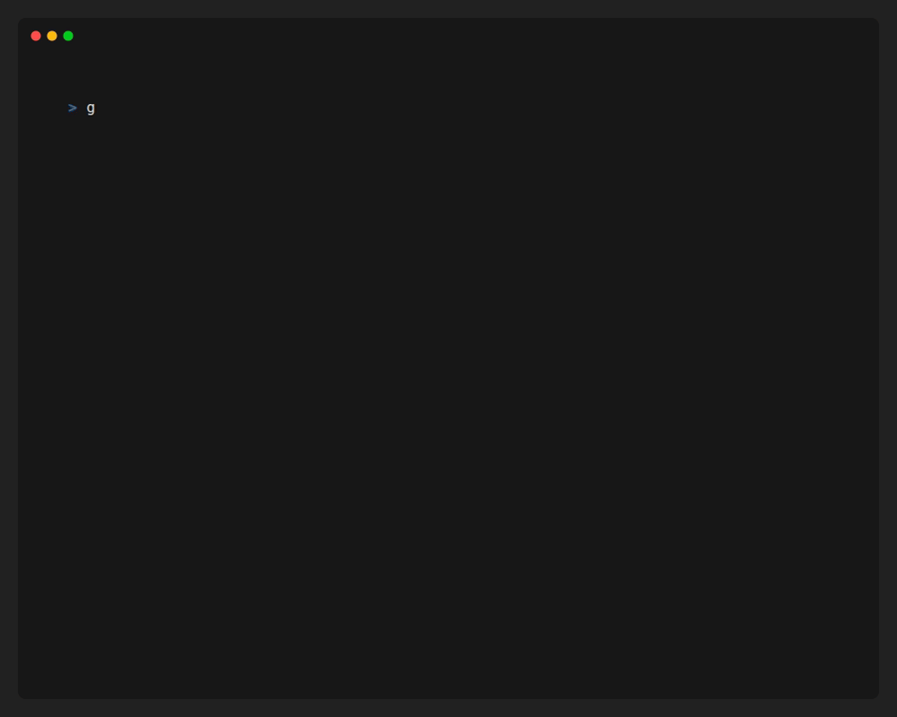

# Bubly CLI

A CLI tool to download video, audio, and transcriptions from YouTube.



## Features

- Download YouTube videos
- Download audio only from YouTube videos
- Download video transcriptions

## Getting Started

1. Clone the repository:
   ```bash
   git clone https://github.com/AbdelilahOu/Bubly-cli-app.git
   ```
2. Navigate to the project directory:
   ```bash
   cd Bubly-cli-app
   ```
3. Run the application:
   ```bash
   go run main.go
   ```
